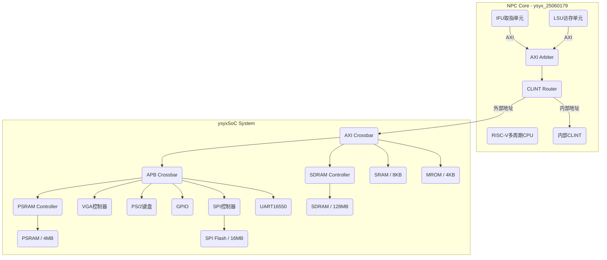
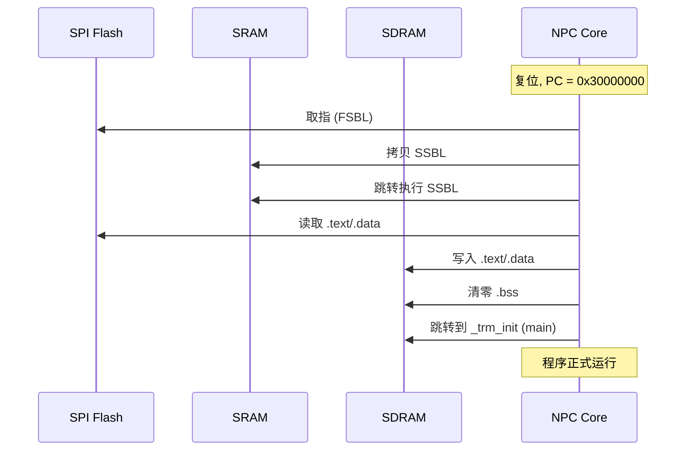

# ysyxSoC 架构与启动流程详解

本文档详细讲解当前 ysyxSoC 平台的硬件架构、外设系统和软件启动流程。

---

## 一、系统整体架构



---

## 二、内存地址映射 (Memory Map)

| 地址范围                     | 大小  | 设备               | 总线类型 | 备注                     |
| ---------------------------- | ----- | ------------------ | -------- | ------------------------ |
| `0x0200_0000 - 0x0200_FFFF`  | 64KB  | **CLINT**          | NPC内部  | 定时器 (mtime)           |
| `0x0F00_0000 - 0x0F00_1FFF`  | 8KB   | **SRAM**           | AXI      | 片上高速SRAM             |
| `0x1000_0000 - 0x1000_0FFF`  | 4KB   | **UART16550**      | APB      | 串口收发                 |
| `0x1000_1000 - 0x1000_1FFF`  | 4KB   | **SPI控制器**      | APB      | Flash/SD卡接口           |
| `0x1000_2000 - 0x1000_200F`  | 16B   | **GPIO**           | APB      | LED/开关                 |
| `0x1001_1000 - 0x1001_1007`  | 8B    | **PS/2键盘**       | APB      | 接收键盘扫描码           |
| `0x2000_0000 - 0x2000_0FFF`  | 4KB   | **MROM**           | AXI      | Boot ROM (只读)          |
| `0x2100_0000 - 0x211F_FFFF`  | 2MB   | **VGA**            | APB      | 帧缓冲显存               |
| `0x3000_0000 - 0x3FFF_FFFF`  | 256MB | **SPI Flash XIP**  | APB      | 程序存储 (只读执行)      |
| `0x8000_0000 - 0x803F_FFFF`  | 4MB   | **PSRAM**          | APB      | 伪静态RAM                |
| `0xA000_0000 - 0xA7FF_FFFF`  | 128MB | **SDRAM**          | AXI/APB  | 主内存 (**4×16bit=32bit并联**) |

**关于 SDRAM 组成：**
当前 SDRAM 子系统由 **MT48LC16M16A2** 系列 SDRAM 芯片组成：
- **单颗容量**: 256Mbit (16M x 16bit) = **32MB**
- **数据位宽拓展至 32 位**: 2 颗芯片并联，提供 32-bit 数据通路。
- **片选 (CS) 为 2 位**: 支持 2 个物理 Rank，每个 Rank 包含 2 颗芯片。
- **DQM 为 4 位**: 控制 4 个字节 (32-bit) 的写入掩码。
- **理论总容量**: 4 颗 x 32MB = **128MB**，已完全启用。
- **仿真模型**: `sdram.v` 中 `MEM_ADDR_BITS=25`，支持完整 128MB。

**验证结果 (RT-Thread `free` 命令)：**
```
heap: [0xa0099600 - 0xa8000000]  // 128MB 地址空间已启用
total    : 133589400 bytes (≈27.4 MB)
available: 100007096 bytes (≈95 MB 可用)
```

**关键理解：**
- **CLINT 是 NPC 核心内部模块**，不通过 SoC 总线。
- **Flash (0x3xxx_xxxx)** 是通过 SPI 控制器的 XIP (eXecute In Place) 映射的，CPU 可以直接从这里取指。
- **SDRAM (0xAxxx_xxxx)** 是主程序和数据的运行目标地址。

---

## 三、NPC 核心内部架构

NPC 核心 (`ysyx_25060179`) 是一个 **RV32E 多周期 CPU**，主要模块包括：

| 模块             | 文件                     | 功能                                             |
| ---------------- | ------------------------ | ------------------------------------------------ |
| 顶层封装         | `ysyx_25060179.sv`       | 标准ysyxSoC接口，AXI4 Master                     |
| CPU核心          | `npc_core.sv`            | 5级流水 (IF/ID/EX/MEM/WB)，多周期状态机          |
| IFU              | `stage_IF.sv`            | 取指单元，直接AXI访问Flash/SRAM/SDRAM            |
| LSU              | `stage_MEM.sv`           | 访存单元，处理Load/Store的AXI事务                |
| AXI Arbiter      | `axi_arbiter.sv`         | 仲裁IFU和LSU的AXI请求                            |
| CLINT Router     | `axi_clint_router.sv`    | 地址路由：CLINT地址内部处理，其余转发到SoC       |
| CLINT            | `axi_clint.sv`           | CLINT实现 (mtime寄存器)                          |

**数据通路:**
```
IFU --AXI--> Arbiter --AXI--> CLINT_Router --AXI--> ysyxSoC总线
LSU --AXI-->         |           |
                     +--> CLINT (内部)
```

---

## 四、软件启动流程 (Boot Sequence)

当前使用的是 `riscv32e-ysyxsoc-sdram-boot` 架构，采用**两阶段引导 (Two-Stage Bootloader)**。

### 4.1 硬件复位

1. CPU 复位向量为 `0x3000_0000` (SPI Flash 的 XIP 起始地址)，定义在 [`npc/vsrc/npc_core.sv`](file:///home/parallels/Desktop/ysyx/ysyx-workbench/npc/vsrc/npc_core.sv) 中。
2. CPU 从 Flash 中取第一条指令开始执行。

### 4.2 FSBL (First Stage Boot Loader)

**相关文件**:
- **启动代码**: [`abstract-machine/am/src/riscv/ysyxsoc/start.S`](file:///home/parallels/Desktop/ysyx/ysyx-workbench/abstract-machine/am/src/riscv/ysyxsoc/start.S) (Line 1-26, `.entry` section)
- **链接脚本**: [`abstract-machine/scripts/ysyxsoc-sdram-boot.ld`](file:///home/parallels/Desktop/ysyx/ysyx-workbench/abstract-machine/scripts/ysyxsoc-sdram-boot.ld) (Line 17-20)

**在 Flash 中执行 (VMA = LMA = 0x3000_0000)**

FSBL 代码位于 `start.S` 的 `.entry` 段。任务：
1. **将 SSBL 从 Flash 拷贝到 SRAM**。
   - 源地址：Flash 中 SSBL 的 LMA (紧随 FSBL 之后)。
   - 目标地址：SRAM (`0x0F00_0000`)。
2. **跳转到 SRAM 执行 SSBL**。

### 4.3 SSBL (Second Stage Boot Loader)

**相关文件**:
- **启动代码**: [`abstract-machine/am/src/riscv/ysyxsoc/start.S`](file:///home/parallels/Desktop/ysyx/ysyx-workbench/abstract-machine/am/src/riscv/ysyxsoc/start.S) (Line 29-87, `.ssbl` section)
- **链接脚本**: [`abstract-machine/scripts/ysyxsoc-sdram-boot.ld`](file:///home/parallels/Desktop/ysyx/ysyx-workbench/abstract-machine/scripts/ysyxsoc-sdram-boot.ld) (Line 23-28)
- **C 运行时初始化**: [`abstract-machine/am/src/riscv/ysyxsoc/trm.c`](file:///home/parallels/Desktop/ysyx/ysyx-workbench/abstract-machine/am/src/riscv/ysyxsoc/trm.c) (`_trm_init`)

**在 SRAM 中执行 (VMA = 0x0F00_0000)**

SSBL 代码位于 `start.S` 的 `.ssbl` 段。任务：
1. **配置 SPI 控制器**：将分频系数设为 0，提高 Flash 读取速度。
2. **初始化栈指针 (SP)**：指向 SRAM 顶部。
3. **将 `.text` 和 `.data` 从 Flash 拷贝到 SDRAM**。
   - `.text` 目标地址：`0xA000_0000` (SDRAM)。
4. **清零 `.bss` 段**。
5. **跳转到 `_trm_init`**：进入 C 运行时，继而调用 `main` 函数。

### 4.4 启动流程图



---

## 五、外设详解

### 5.1 UART16550
- **地址**: `0x10000000`
- **功能**: 串口输入输出，用于 `printf` 和 shell 交互。
- **关键寄存器**: THR (发送), RBR (接收), LSR (状态), LCR (配置)。

### 5.2 SPI 控制器 + Flash
- **控制器地址**: `0x10001000`
- **Flash XIP 地址**: `0x30000000 - 0x3FFFFFFF`
- **功能**: 通过 SPI 协议访问 NOR Flash，支持 XIP 直接执行。

### 5.3 VGA 控制器
- **地址**: `0x21000000`
- **分辨率**: 640x480 @ 60Hz
- **像素格式**: 32-bit ARGB
- **操作**: 写入地址偏移设置光标，写入数据寄存器绘制像素。

### 5.4 PS/2 键盘控制器
- **地址**: `0x10011000`
- **功能**: 接收 PS/2 Set 2 扫描码。
- **软件处理**: 需在驱动中实现 E0/F0 前缀的状态机解析。

### 5.5 CLINT (Core Local Interruptor)
- **地址**: `0x0200BFF8` (mtime_lo), `0x0200BFFC` (mtime_hi)
- **功能**: 提供 64-bit 单调递增的 `mtime` 寄存器，用于 `uptime()` 和 OS 时钟中断。
- **实现**: 在 NPC 核心内部，不经过 SoC 总线。

---

## 六、当前硬件限制与待改进

| 问题             | 影响                             | 改进方向             |
| ---------------- | -------------------------------- | -------------------- |
| **无 I-Cache**   | 每条指令都需完整 AXI 事务读 SDRAM | 实现简单的直接映射 Cache |
| **无 D-Cache**   | 数据访问延迟高                   | 同上                 |
| **单发射**       | IPC 上限为 1                     | 考虑流水线优化       |
| **Flash 速度慢** | 启动拷贝耗时长                   | 已通过 SSBL 在 SRAM 优化 |

---

以上即是当前 ysyxSoC 平台的完整架构和启动流程。如有更深入的硬件或软件问题，欢迎继续探讨！
